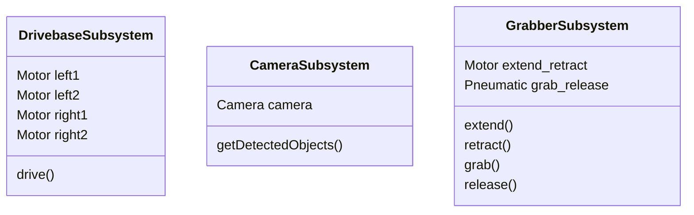
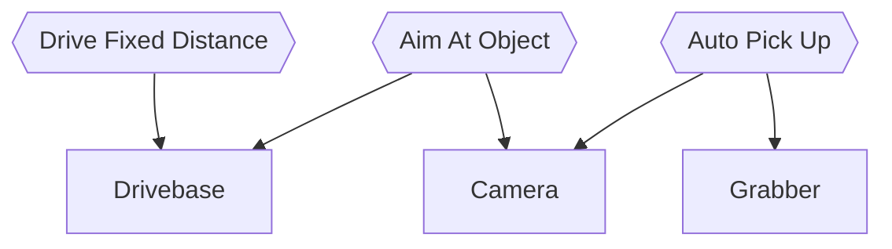

# Command-Based Programming

The big-picture overview of Command-Based Programming includes two major components: [Subsystems] and [Commands].

[Subsystems] are groups of related hardware intended to serve the same purpose.
For example, since each motor is represented as an individual object in WPILib,
a subsystem could be created for a mechanism that uses 2 motors.

Each subsystem is a class that wraps up all the hardware components into a single object,
providing methods to accomplish the basic operation of the mechanism.

Subsystems should also be used even when only a single hardware component is used to accomplish a task.
This is because using a subsystem allows for more descriptive method names and cleaner interactions with commands.

Generally, subsystems should include hardware components that will always be used simultaneously.

The following diagrams show what the member variables and methods of a subsystem might look like for:

- A drivebase with 4 motors, 2 on each side
- A camera that can detect objects in front of the robot (note that this is just a wrapper around a library-provided object)
- A grabber mechanism with one motor extending and retracting an arm, and a pneumatic closing and opening a claw to grab and release objects

[Commands] are tasks that the robot can carry out.
They can be created, run in parallel and cancelled at any point.
They "depend" on subsystems, using subsystem class methods to accomplish tasks.
They must be used for long-running (more than a few milliseconds) tasks or any higher-level logic that spans across subsystems.
WPILib handles the execution of these tasks - the robot code only needs to define them and specify when they should run.

Using the subsystems from the previous diagram, here are some possible commands (hexagon nodes) and which subsystems (rectangle nodes) they depend on:

[Subsystems] and [Commands] will be covered in more detail in their respective chapters.

[Subsystems]: command-based/subsystems/overview.md
[Commands]: command-based/commands/overview.md
