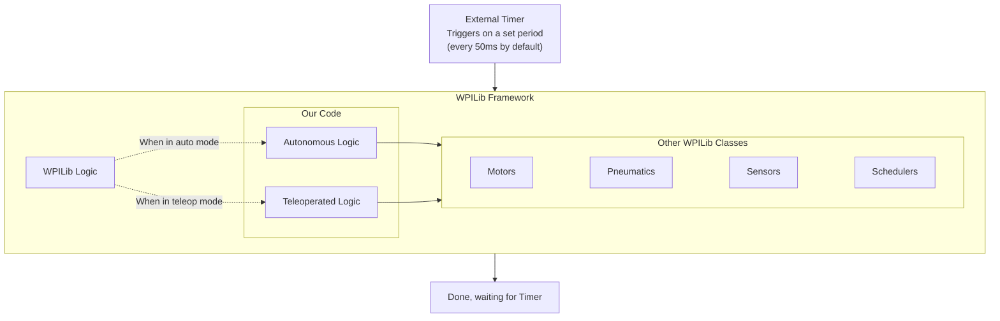

# Overview

To give a high-level overview of how an FRC robot works, we'll present diagrams representing the
hardware and software components commonly found on a typical FRC robot.

Don't worry if you aren't familiar with all the terminology used here -
these diagrams are only to give a high-level overview of the components and how they interact.

Also keep in mind that some aspects are deliberately oversimplified.
The goal is not to be perfectly accurate, but to be close enough for a broad understanding.
We will refine and expand upon parts of these diagrams in later sections.

Here's a breakdown of the hardware commonly involved in FRC competitions:

Key takeaways:

- At the center of everything is the RoboRIO. This is where most of the code you write will be executed.
- There is a secondary processor, typically a Raspberry Pi, used for vision processing.
  This is covered in more detail in the [Vision] section of this guide.

[Vision]: vision/intro.md

As for the software:

Key takeaways:

- All of the code you will write is within a framework called **WPILib**.
- WPILib handles as much as possible, from scheduling to interacting with hardware, leaving us to write the robot-specific logic.
- All of our code is called on a schedule, by default every 50 milliseconds, although this is configurable.
  Following WPILib's terminology, this guide will refer to one iteration of this loop as a **Periodic Cycle**.
  Since our code is called at the start of every Periodic Cycle, it must finish running before the start of the next cycle.

## Terms and definitions

**FRC**: First Robotics Competition - the entire competition and community, including
building the robots, programming, wiring, social media, business, driving, etc.
Also sometimes called **FIRST**, although technically FIRST is the nonprofit that
organizes the competitions.

**WPILib**: A [framework] used by almost all FRC teams for programming. WPILib handles many
of the hardest parts of robot coding for you, wrapping them up in a nicer, easier-to-use
library. Examples of WPILib features include controlling almost all FRC hardware such as motors
and solenoids, setting up a main loop to run every 20ms, and providing a framework for Command-Based Programming.

**Command-Based Programming**: A [paradigm] used within WPILib code. It's intended to allow
you to have the robot perform multiple actions at the same time, without allowing you to
accidentally have the same hardware trying to do both. WPILib offers other paradigms, but
Command-Based is the most popular and generally the easiest to use. This guide focuses on
Command-Based Programming - see [Chapter 2][command-based-chapter].

**Subsystems** and **Commands**: Important concepts in Command-Based Programming.
Subsystems are groups made up of one or more pieces of physical hardware on the robot with
a common purpose (e.g. a grabber, a drivetrain, etc.) and commands are actions that these
subsystems can take (e.g. pick up an object, follow a preprogrammed path, etc.).

**Periodic Cycle**: One iteration of the main loop of robot code.
Not an official term, but WPILib commonly uses the term "Periodic" for functions called in each cycle,
so this guide will try to use the same terminology. Be aware, however, that the term "cycle" is also
used for the time it takes for your robot to score game points.

[framework]: https://en.wikipedia.org/wiki/Software_framework
[paradigm]: https://en.wikipedia.org/wiki/Programming_paradigm
[command-based-chapter]: command-based/intro.md
