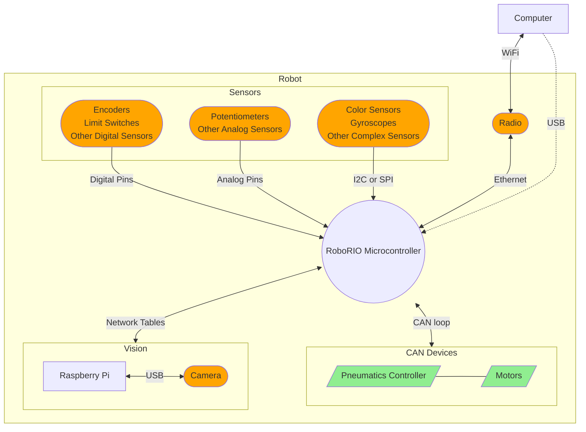
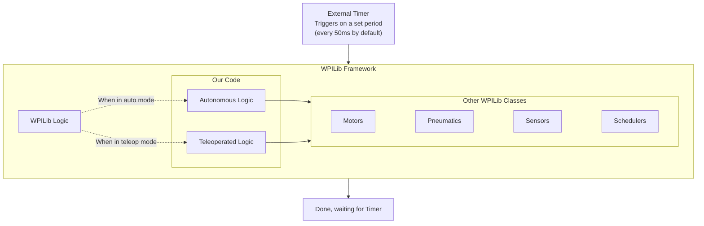

# Overview

Here's a breakdown of the hardware commonly involved in FRC competitions:

On the software side, an oversimplified diagram might look like this:

## Terms and definitions

**FRC**: First Robotics Competition - the entire competition and community, including
building the robots, programming, wiring, social media, business, driving, etc.
Also sometimes called **FIRST**, although technically FIRST is the nonprofit that
organizes the competitions.

**WPILib**: A [framework] used by almost all FRC teams for programming. WPILib handles many
of the hardest parts of robot coding for you, wrapping them up in a nicer, easier-to-use
library. Examples of WPILib features include controlling almost all FRC hardware such as motors
and solenoids, setting up a main loop to run every 20ms, and providing a framework for Command-Based Programming.

**Command-Based Programming**: A [paradigm] used within WPILib code. It's intended to allow
you to have the robot perform multiple actions at the same time, without allowing you to
accidentally have the same hardware trying to do both. WPILib offers other paradigms, but
Command-Based is the most popular and generally the easiest to use. This guide focuses on
Command-Based Programming - see [Chapter 2][command-based-chapter].

**Subsystems** and **Commands**: Important concepts in Command-Based Programming.
Subsystems are groups made up of one or more pieces of physical hardware on the robot with
a common purpose (e.g. a grabber, a drivetrain, etc.) and commands are actions that these
subsystems can take (e.g. pick up an object, follow a preprogrammed path, etc.).

[framework]: https://en.wikipedia.org/wiki/Software_framework
[paradigm]: https://en.wikipedia.org/wiki/Programming_paradigm
[command-based-chapter]: /command-based/intro.md
